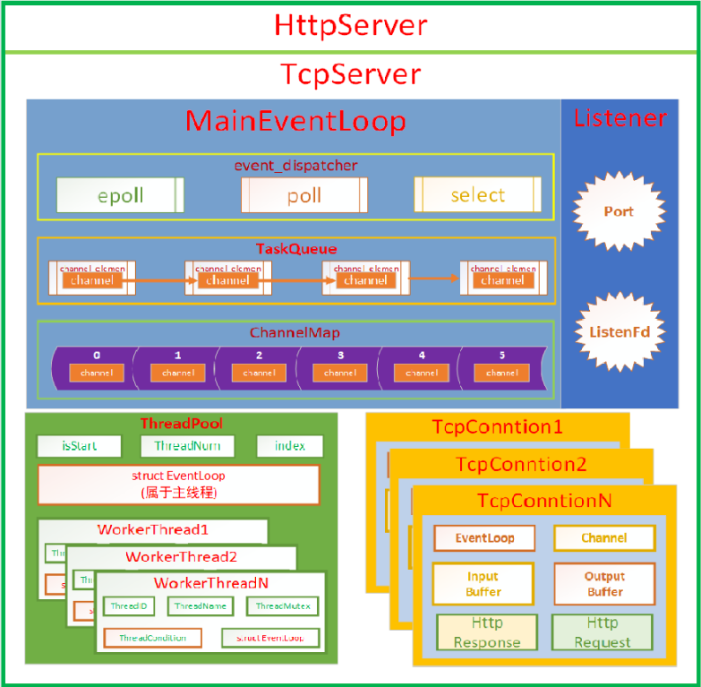
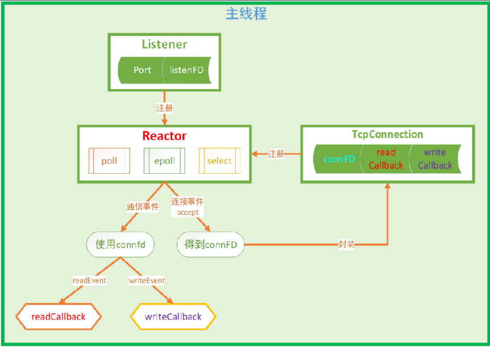
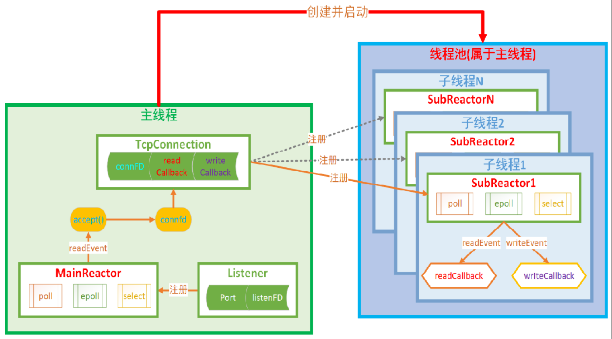
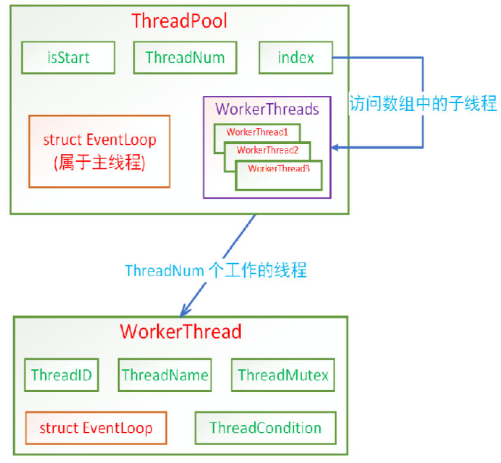

# webserver
基于Reactor模型的高并发web服务器

这里HttpServer主要的核心就是TcpServer
TcpServer组成部分有，用于监听的套接字、主EventLoop（这里面有一个分发器（event_dispatcher）、一个任务队列（TaskQueue）记录程序的需求、对文件描述符封装的channel进行映射（ChannelMap））、线程池（这里面记录了主线程反应堆模型的实例（struct EventLoop）为什么要这么做，目的在于当线程池中线程数量为0时，可以将所有的任务放到主线程里面去做、每个子线程里面也有一个反应堆模型和主线程中的EventLoop封装是一样的）、TcpConntion就是对每一个连接上来的客户端套接字进行了封装（EventLoop（保存的就是这个套接字被放到的那个EventLoop）、Channel（就是对套接字进行封装的得到的Channel模块，里面有文件描述符以及回调函数等等）、InputBuffer（用来接收数据的）、OutputBuffer（用来发送数据的）、HttpRequest（用于解析http数据）、HttpResponse（用于组装http数据））

在主线程里面绑定本地IP和端口，得到一个用于通信的套接字，将这个通信套接字的读事件注册到Reactor反应堆模型中，Reactor底层用到的就是poll/epoll/select I/O多路复用技术，当套接字被触发时就证明有新连接到达了，这时候就会对新连接的客户端套接字进行封装，然后将他注册到Reactor模型中，如果是客户端的套接字有事件触发，这时就可以根据是读事件还是写事件就可以调用在注册时设置的回调函数来进行处理

多反应堆模型：在主线程里面绑定本地IP和端口，得到一个用于通信的套接字，将这个通信套接字的读事件注册到主Reactor反应堆模型中，在这个主反应堆模型中对通信套接字进行监听，当有客户端连接时，这时候就会对新连接的客户端套接字进行封装，但是不再像单反应堆一样将他注册到主Reactor反应堆模型中了，而是开了一个线程池这个线程池里面每一个子线程都是一个子反应堆，我们就将客户端的套接字注册到子Reactor反应堆模型中，这个我们在进行客户端套接字注册的时候也可以设置一个负载均衡机制

## 多线程惊群问题

> 鸟群捕食，一鸟受惊，全鸟皆飞

产生的原因是因为，多个线程去处理一件事情，假设说现在来了一个需求，这个需求只需要一个线程去做，但是呢多线程是通过条件变量来控制的，也就是说当这个条件变量变为可使用时，所有在等待的线程就会被唤醒，但是这个任务只需要一个线程去做，这时候被唤醒的其它线程就会发现没有事情做，但是它们被唤醒依然是需要占用CPU资源的，所以就会出现在一瞬间CPU的值急剧飙升然后又下降到谷底，这就是所谓的多线程惊群现象

解决多线程惊群的做法就是将多线程转换为线程池